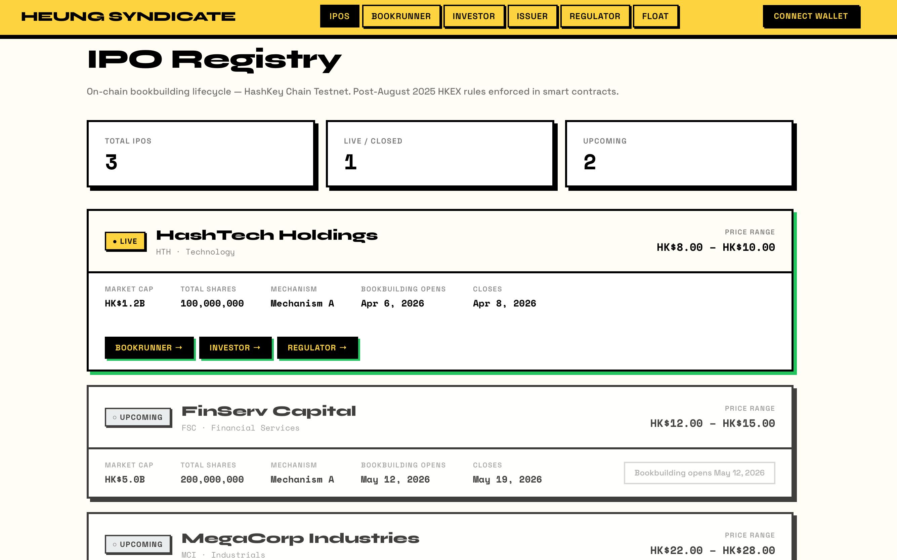
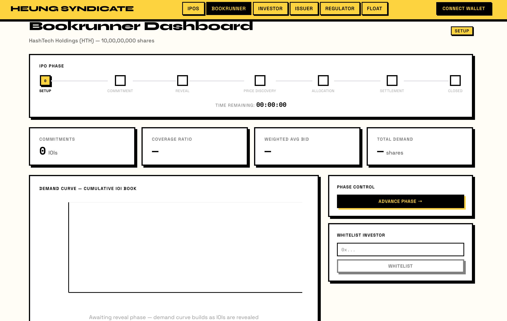
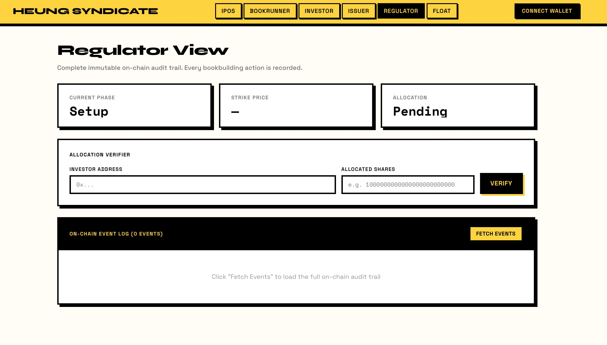
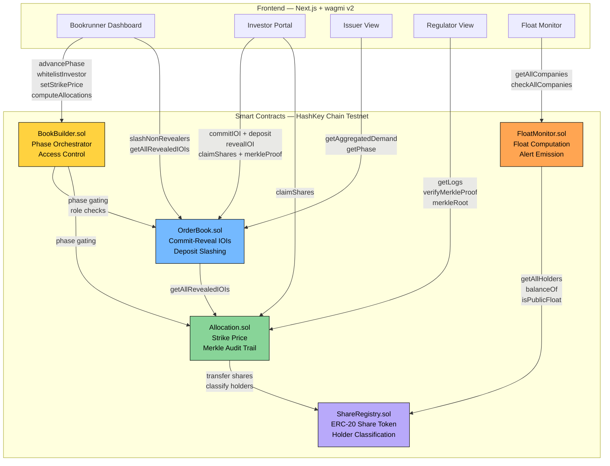

# Heung Syndicate

<table>
  <tr>
    <td></td>
    <td></td>
  </tr>
  <tr>
    <td></td>
    <td></td>
  </tr>
</table>

The complete on-chain IPO lifecycle compliance infrastructure for post-August 2025 HKEX rules. Deployed on HashKey Chain, the only SFC-licensed L2 in existence.

---

## Architecture



---

## The Problem

Hong Kong's IPO process has three critical gaps that FINI's T+2 settlement system deliberately left untouched:

1. **Bookbuilding runs on phone calls and spreadsheets.** The issuer sees only the bookrunner's characterization of demand, not the actual order book. Inflated orders and misleading book messages are structurally impossible to detect.

2. **Allocation data is not publicly verifiable.** FINI records the outcome but there is no way for an investor, regulator, or auditor to independently verify that allocation was computed correctly.

3. **Post-IPO float compliance monitoring is entirely manual.** Every company that listed after August 4, 2025 has new ongoing public float obligations under HKEX's tiered threshold rules. There is no automated system checking compliance.

Heung Syndicate closes all three gaps in one system.

---

## The Three Modules

### Module 1: On-Chain Bookbuilding (Commit-Reveal)

Investors submit cryptographically sealed IOI bids using a commit-reveal scheme. The bid (price, quantity, salt) is hashed client-side and committed on-chain. During the reveal phase, investors publish their actual bid and the contract verifies it matches the hash. Investors who fail to reveal forfeit their deposit.

This eliminates inflated orders and misleading book messages. The issuer sees real-time verified aggregate demand, not the bookrunner's characterization of it.

**HKEX August 2025 rules enforced in the contract:**
- Minimum 40% of total shares must go to the bookbuilding placing tranche (reverts if violated)
- Public subscription tranche starts at 5%, clawback up to 35% (Mechanism A)
- Cornerstone investors capped at 55% (Mechanism A) or 50% (Mechanism B)
- Cornerstone 6-month lock-up enforced via time-lock
- Connected-person flags required per SFC compliance rules

### Module 2: Transparent Allocation Reporting (Merkle Audit Trail)

After each IPO closes, allocations are computed on-chain and a Merkle root is published to the contract. Every investor can verify their allocation is correctly included by generating a proof client-side. The SFC can reconstruct the entire book from on-chain events.

Allocation data moves from a closed system into a verifiable, immutable on-chain record.

### Module 3: Real-Time Float Compliance Monitoring

A smart contract monitors on-chain share distribution against HKEX tiered thresholds and flags companies approaching or breaching minimum float requirements.

**HKEX ongoing public float requirements:**

| Market Cap | Minimum Public Float |
|---|---|
| Below HK$3 billion | 25% |
| HK$3B to HK$10B | 20% |
| Above HK$10 billion | 15% |

Warning is triggered when float falls within 2% of the minimum. Breach is triggered when float falls below the minimum. Both emit on-chain events that the dashboard polls every 10 seconds.

---

## Why HashKey Chain

- The only L2 operated by an entity holding SFC Type 1, 4, 7, and 9 licenses plus an AMLO license
- Full EVM equivalence, every Solidity pattern and OpenZeppelin library works unchanged
- Gas cost is approximately $0.000639 per operation, 100 IOI submissions costs fractions of a cent
- Block time is approximately 2 seconds, fast enough for real-time dashboard polling
- HashKey Group completed its own HKEX IPO in early 2026 and understands the exact problem being solved
- The regulatory moat is real and not replicable on any general-purpose chain

---

## Smart Contracts

| Contract | Purpose |
|---|---|
| `BookBuilder.sol` | Phase orchestrator, access control, offering parameters |
| `OrderBook.sol` | Commit-reveal IOI management, deposit slashing |
| `Allocation.sol` | Strike price, pro-rata allocation, Merkle audit trail |
| `ShareRegistry.sol` | ERC-20 share token with holder classification |
| `FloatMonitor.sol` | Ongoing public float compliance tracking |

**Deployed on HashKey Chain Testnet (Chain ID 133)**

---

## Frontend Views

| View | Path | Description |
|---|---|---|
| IPO Registry | `/ipos` | All IPOs, status derived live from contract phase |
| Bookrunner Dashboard | `/dashboard` | Phase controls, demand curve, order book, allocation |
| Investor Portal | `/investor` | Commit IOI, reveal bid, claim allocated shares |
| Issuer View | `/issuer` | Aggregate demand only, no individual orders visible |
| Regulator View | `/regulator` | Full audit trail, Merkle verifier, event log |
| Float Monitor | `/float` | Real-time compliance dashboard for all listed companies |

---

## Tech Stack

| Layer | Choice |
|---|---|
| Chain | HashKey Chain Testnet (Chain ID 133) |
| Contracts | Solidity 0.8.24 + Foundry |
| Merkle | OpenZeppelin MerkleProof + merkletreejs |
| Frontend | Next.js 15 + TypeScript |
| Web3 | wagmi v2 + viem |
| Charts | Recharts |
| Styling | Tailwind CSS + Neo Brutalism design system |

---

## Local Development

### Prerequisites

- [Foundry](https://book.getfoundry.sh/getting-started/installation)
- Node.js 18+
- A HashKey Chain Testnet wallet with HSK (faucet: `https://faucet.hsk.xyz/faucet`)

### Deploy Contracts

```bash
# Clone the repo
git clone https://github.com/Ra9huvansh/Heung-Syndicate
cd Heung-Syndicate

# Set your private key
echo "PRIVATE_KEY=0x..." > .env

# Deploy all 5 contracts to HashKey Testnet
forge script script/Deploy.s.sol --rpc-url https://testnet.hsk.xyz --broadcast
```

The script prints all contract addresses. Copy them into `frontend/.env.local`.

### Run the Frontend

```bash
cd frontend
cp .env.local.example .env.local  # fill in contract addresses
npm install
npm run dev
```

Open `http://localhost:3000`.

---

## Demo Flow

1. **Float dashboard** (`/float`) — three companies, one in BREACH, one WARNING, one SAFE. Live on-chain float monitoring.

2. **Bookrunner dashboard** (`/dashboard`) — whitelist an investor wallet, advance to Commitment phase.

3. **Investor portal** (`/investor`) — commit a sealed IOI bid with price and quantity.

4. **Advance to Reveal** — investor reveals their bid, demand curve updates live.

5. **Price Discovery** — bookrunner sets strike price, red line snaps onto the demand curve.

6. **Allocation** — contract enforces tranche rules, computes pro-rata allocation, publishes Merkle root on-chain.

7. **Regulator view** (`/regulator`) — enter investor address and allocation amount, verify Merkle proof. Result: VALID.

---

## Network Details

- RPC: `https://testnet.hsk.xyz`
- Chain ID: `133`
- Explorer: `https://testnet-explorer.hsk.xyz`
- Faucet: `https://faucet.hsk.xyz/faucet`

---

## Security Analysis

Both Slither and Aderyn static analyzers were run against all 5 contracts. Full reports are in the `audits/` directory.

| Tool | Findings | Notes |
|---|---|---|
| Slither | 54 results | Majority are informational (pragma versions from OZ deps, timestamp usage, low-level calls intentional for ETH refund) |
| Aderyn | See report | Cyfrin's Rust-based analyzer, full markdown report included |

**Key findings and mitigations:**

- `arbitrary-send-eth` in `OrderBook.withdrawSlashed()` — intentional, only callable by the bookrunner to withdraw slashed deposits to themselves, not an arbitrary address
- `calls-loop` in `FloatMonitor.computePublicFloat()` — known gas limitation for on-chain float computation over all holders; acceptable for a testnet prototype with a bounded holder set
- `divide-before-multiply` in `Allocation.computeAllocations()` — integer division rounding acknowledged, amounts to at most 1 wei precision loss per tranche
- `timestamp` usage in `BookBuilder` — necessary for phase deadline enforcement; miner manipulation not a concern on HashKey Chain's PoS L2
- All pragma version warnings originate from OpenZeppelin library dependencies, not custom contracts

Full reports: [Aderyn](audits/aderyn-report.md) | [Slither](audits/slither-report.txt)

---

## Relationship to FINI

FINI handles T+2 settlement. Heung Syndicate handles everything before it. The two systems are complementary. We are not replacing FINI. We are the missing bookbuilding module that feeds verified allocation data into FINI's settlement workflow.
